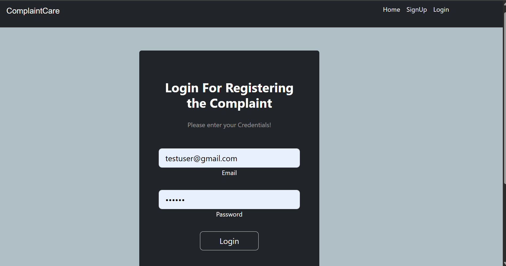
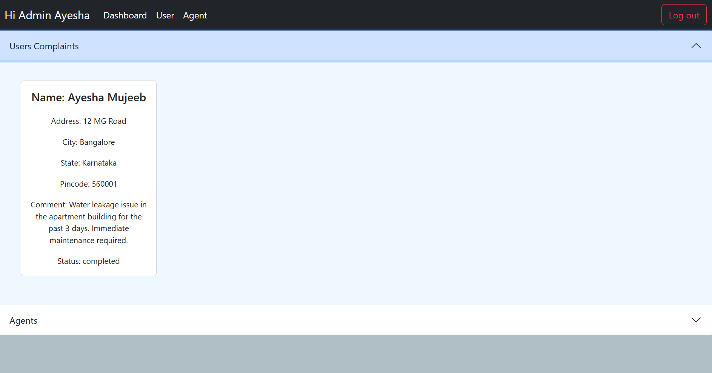
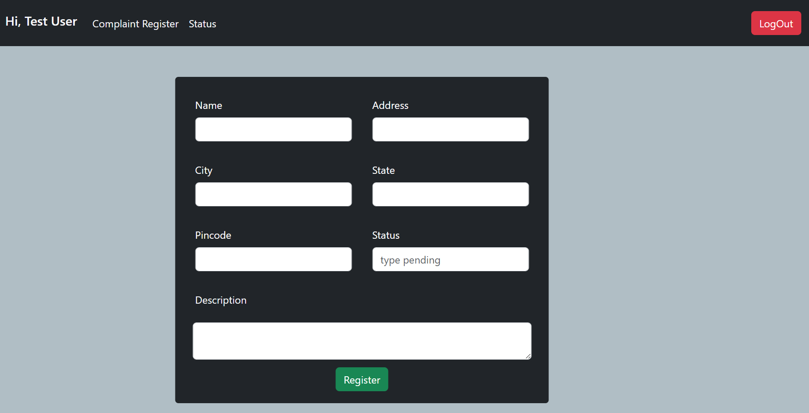
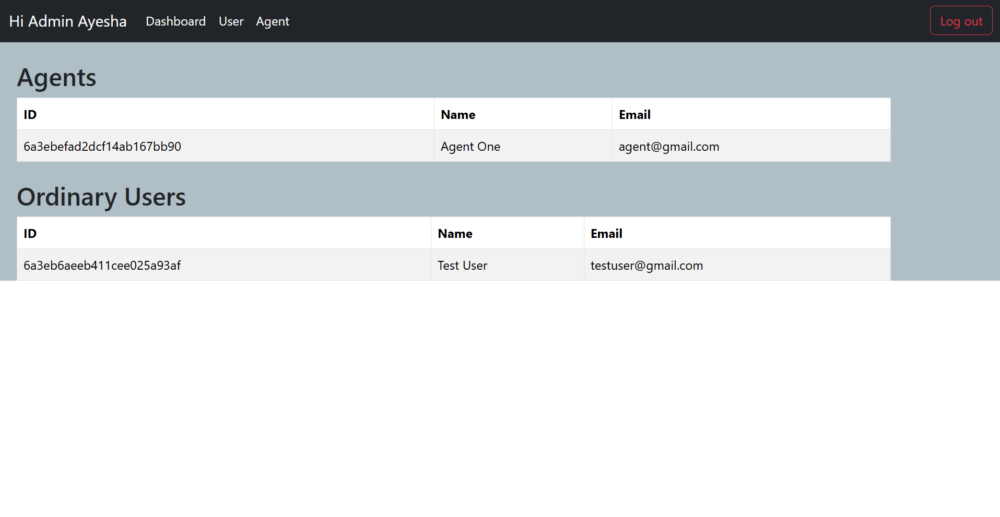

# 🛡️ Complaint Management System

---

## 📌 About the Project

The **Complaint Management System** is a full-stack web application designed to simplify the process of registering, tracking, and resolving user complaints in an organized and efficient manner.

It provides a seamless interface for users to submit complaints and for administrators to manage and resolve them in real time.

---

## 🎯 Key Features

- 👤 User Registration & Login (JWT Authentication)
- 📝 Submit Complaints Easily
- 📊 Track Complaint Status (Pending / In Progress / Resolved)
- 🛠️ Admin Dashboard for Management
- 🔐 Secure Authentication System
- ⚡ REST API Integration
- 📱 Responsive UI for all devices

---

## 🛠️ Tech Stack

- **Frontend:** React.js, CSS
- **Backend:** Node.js, Express.js
- **Database:** MongoDB
- **Authentication:** JSON Web Tokens (JWT)

---
---

## 📸 Screenshots

### Landing Page 
![Landing] (screenshots\landing.png)

### Registration Page

### 🔐 Login Page

### 📊 User Dashboard

### 📝 Complaint Submission Form

### 🛠️ Admin Panel

### Agent Panel
